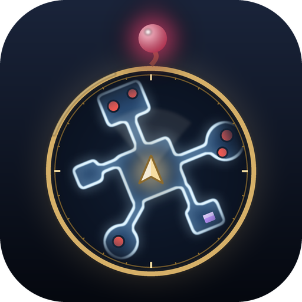

<p align="center">
  
</p>

# MoogleMap

**A see-through map over your screen, one key away. Kupo!**

A [Dalamud](https://github.com/goatcorp/Dalamud) plugin for Final Fantasy XIV that lays a transparent map right over the game, the way action RPGs do. Press your key and the layout around you appears on top of the world, with you in the middle and the map turning with your camera, so what's ahead on the map is what's ahead on screen.

[](https://www.patreon.com/GitHixy)
[](https://discord.gg/9kjUjWDBkJ)

[](LICENSE)


---

## What it does

### Only where you can walk

A parchment disc over your screen hides more than it shows, so MoogleMap draws just the walkable floor and its walls, in your colours, with sharp lines at any zoom. It works that out two ways:

- **From the map picture**, in dungeons, trials and alliance raids, whose maps are drawn as clean plans.
- **From the world itself**: the game's own collision, explored outwards from wherever you, NPCs and other players are standing. That's how towns get their map - their pictures paint streets and rooftops in the same colour - and how duty maps get the stacked levels, bridges and narrow passages a picture can't show. Towns fill in within a few seconds; open fields fill in around you as you travel. Everything found is remembered for next time.

### Where there is no map

Deep dungeon floors (and a few other places) have no map picture at all: the game draws those from room data. There the floor appears around you as you walk, room by room. It doesn't see through walls, so the next room stays dark until you go in, and each floor starts dark again.

### What's on it

- **People**: your party and alliance (including trust and duty support allies) in their role colours with a ring for their health (a skull when they're down, green once a raise is on its way), optionally with their jobs, and other players.
- **Enemies**, with the ones already in a fight in their own colour and pulsing.
- **NPCs**, **treasure coffers**, **aetherytes**, **gathering points**, doors, exits and other things you can click.
- **Quests in progress**: NPCs and objects with a quest icon over their heads (someone to talk to, something to hand in) shown with that same icon, quest objectives with their names, and objectives that are an area drawn as the game's light blue circle.
- **Map icons and place names**, with the game's own icons.
- **Quest markers**, your **flag** and running **FATEs**, each FATE with a ring that fills as it's completed and the time it has left. FATEs open out as they appear, flare gold with sparks when completed and grey out when failed. Party members, quest markers and the flag stay pinned to the rim when they're off the map, like a compass.
- **Waymarks** (A to D, 1 to 4) where they're placed, and **signs** (attack, bind, ignore, shapes) over whoever they mark.
- Enemies whose target is **you** in their own colour, and a turning **ring** around your current target.
- In duties the **boss** gets a crown, a bigger marker, and its name and health always on show.
- Your **trail**: where you've walked in the last few minutes, fading as it ages.
- A **compass** - N, E, S, W - inside the map, turning with it.
- You, as an arrow, with your camera's view as a soft cone.

Every layer can be turned off, and names for enemies, NPCs and objects are separate switches.

### Made to stay out of the way

- **Toggle** or **hold** a key of your choice, with any of Ctrl, Shift and Alt. The key can be kept from the game so it doesn't also do something there.
- An entry in the **server info bar**: click to show or hide the map, right-click for settings, scroll to zoom. It shows how far along the map is while it's being built.
- Typing in chat never opens it.
- Optionally hides the game's own minimap, for a cleaner screen with the map a key away.
- Fades in and out, with a soft rim instead of a hard edge, and a sonar wave sweeping out from you as it opens.
- Optional effects: a band of light running out across the walls every few seconds, and a ripple from your arrow. Follows Dalamud's reduced motion setting.
- Optional zoom keys that only work while the map is up.
- Hides in cutscenes, GPose and loading screens, and optionally in combat.
- Zoom, size and opacity are kept **per kind of place** - duties, towns, open fields - and switch as you travel.
- Colours, rotation and position are all yours to tune, with the map shown live while the settings are open.

## Getting started

1. Install MoogleMap from the plugin installer.
2. Type `/mooglemap` (or `/mmap`) and pick your key under **Controls**. The default is **Alt + M**.
3. Press it anywhere. Dungeons are where it shines.

| Command | What it does |
| --- | --- |
| `/mooglemap` | Open the settings (also `/mmap`) |
| `/mmap toggle` | Show or hide the map (also `show`, `hide`), handy for a macro |
| `/mmap zoom in` / `zoom out` | Zoom the map |
| `/mmap explore reset` | Forget the floor mapped so far |

## How it works

Dungeon maps keep their parchment perfectly flat and draw the floor as a slightly lighter, less yellow area, fenced in by a brown shadow along every wall. MoogleMap uses both clues - the colour, and being enclosed by that shadow - since each catches what the other misses, then closes the gaps left by place names and drops stray specks. The edge of that floor becomes smooth wall lines, drawn on top at a fixed thickness.

Exploring uses the same collision the game uses to keep you on the ground. From a known walkable spot, each step to a neighbouring yalm first checks for a wall at chest height, then looks for ground from just above your feet, which is what lets it pass under bridges and arches instead of landing on them. Every level of a spot is kept, so a street and the walkway over it are both walkable. It spends about a millisecond a frame and never touches anything the game doesn't already have loaded.

Nothing is shipped with the plugin: it works from the game's own files and world, in any language, and keeps up with new content by itself.

## Plays by the rules

MoogleMap is purely visual. It only shows what the game already lets you see: objects the game keeps hidden, like traps, stay hidden, and the map switches itself off in PvP. It never moves your character or sends anything to the game. Settings are stored locally and nothing is ever uploaded.

## Feedback

Found a bug or have an idea? **Settings → Diagnostics** shows what the plugin sees on the current map, copies a report and opens a GitHub issue for you. Or come and talk about it on [Discord](https://discord.gg/9kjUjWDBkJ).

## Building

```
dotnet build -c Release
```

Requires the .NET 10 SDK and Dalamud's dev files (installed with XIVLauncher). The icon is generated by `python tools/make_icon.py` (needs Pillow and NumPy).

## License

GPL-3.0. See [LICENSE](LICENSE).
